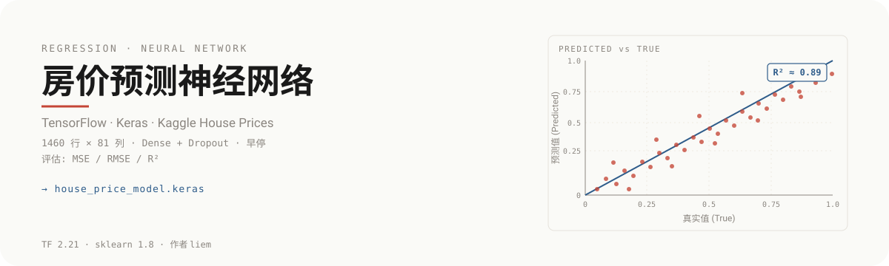

<p align="center">
  
</p>

# 房价预测神经网络

基于 TensorFlow / Keras 的全连接神经网络回归模型,使用 Kaggle House Prices 数据集(1460 行 × 81 列),覆盖数据预处理、过拟合控制与完整评估可视化的端到端实验链路。

## 评估证据

回归模型的评估原点是把预测值与真实值放到同一坐标系:横轴为真实房价,纵轴为模型预测值,深蓝实线为理想对角线 y=x。散点越贴近对角线,模型回归质量越高。上方 hero 中的散点图正呈现这一评估视角的典型形态。

仓库 `figures/` 目录提供四张真实可视化产物,作为本仓库实验的原始证据:

| 文件 | 内容 | 用途 |
| --- | --- | --- |
| `figures/training_curve.png` | 训练曲线 | 训练 / 验证损失随 epoch 变化,判断收敛与过拟合 |
| `figures/pred_vs_true.png` | 预测-真实散点 | 真实值 vs 预测值,直观评估回归贴合度 |
| `figures/residuals.png` | 残差分布 | 残差(预测 − 真实)的分布形态,检验系统性偏差 |
| `figures/label_distribution.png` | 标签分布 | 房价标签的原始分布,理解目标变量形态 |

## 这是什么

一个端到端的房价回归实验项目:用全连接神经网络学习 81 列结构化特征到连续房价的映射,产出可复用的 `house_price_model.keras` 模型与四类评估图表。

## 与简单基线的不同

- **网络结构**:多个 `Dense` 隐藏层叠加,逐步压缩特征维度,而非单层线性回归
- **过拟合控制**:每层配 `Dropout` 随机失活,并启用早停(EarlyStopping)在验证损失不再下降时终止训练
- **完整评估**:同时给出 MSE / RMSE / R² 三个回归指标,并产出训练曲线、预测-真实散点、残差图与标签分布四类可视化
- **可复用产物**:训练完成后保存 `house_price_model.keras`,可直接加载推理

## 工作流程

```
原始 CSV (1460 × 81)
        │
        ▼
┌───────────────────┐
│  数据预处理         │  缺失值填充 · 类别编码 · 数值缩放
└───────────────────┘
        │
        ▼
┌───────────────────┐
│  网络结构           │  Dense × N + Dropout · 末层线性回归输出
└───────────────────┘
        │
        ▼
┌───────────────────┐
│  训练 + 过拟合控制   │  EarlyStopping · 验证集监控
└───────────────────┘
        │
        ▼
┌───────────────────┐
│  评估 + 可视化       │  MSE / RMSE / R² · 四张图表
└───────────────────┘
        │
        ▼
   house_price_model.keras
```

## 如何运行

依赖环境:Python 3.13 / TensorFlow 2.21 / Keras / scikit-learn 1.8 / Pandas / NumPy / Matplotlib

```bash
pip install tensorflow pandas numpy scikit-learn matplotlib
```

打开 `skill_test/神经网络模型实现_房价预测.ipynb`,按单元格顺序执行即可完成预处理 → 训练 → 评估 → 出图 → 保存模型全流程。

辅助脚本:

- `check_v2.py` — 检查数据与中间产物
- `fill_v3.py` — 缺失值填充流程
- `read_report.py` — 读取并打印 `metrics.json` 评估报告
- `metrics.json` — 训练完成后的最终指标快照

## 评估指标

<p align="center">
  
</p>

回归任务的核心指标:

| 指标 | 含义 | 越好方向 |
| --- | --- | --- |
| **MSE** | 均方误差,放大较大预测误差 | 越小 |
| **RMSE** | 均方根误差,与原值同量纲,便于解读 | 越小 |
| **R²** | 决定系数,模型相对均值基线的解释力 | 越接近 1 |

理想回归模型在测试集上同时具备较低的 RMSE 与接近 1 的 R²,且残差分布近似零均值。

## 项目结构

```
house-price-prediction/
├── skill_test/
│   ├── 神经网络模型实现_房价预测.ipynb   # 主实验 notebook
│   ├── house_prices.csv                # Kaggle 数据集
│   ├── house_prices_cols.txt           # 字段说明
│   └── house_price_model.keras         # 训练后的模型权重
├── figures/
│   ├── training_curve.png              # 训练曲线
│   ├── pred_vs_true.png                # 预测-真实散点
│   ├── residuals.png                   # 残差分布
│   └── label_distribution.png          # 标签分布
├── check_v2.py
├── fill_v3.py
├── read_report.py
└── metrics.json
```

## 技术栈

Python 3.13 · TensorFlow 2.21 · Keras · scikit-learn 1.8 · Pandas · NumPy · Matplotlib

---

作者 liem · TensorFlow 2.21 · Kaggle House Prices 数据集
